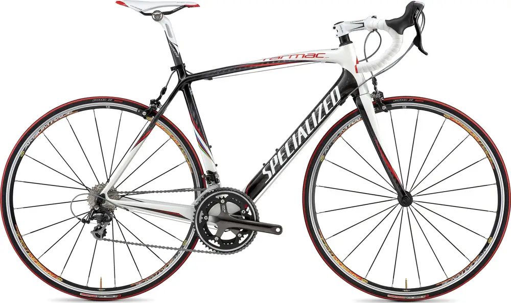
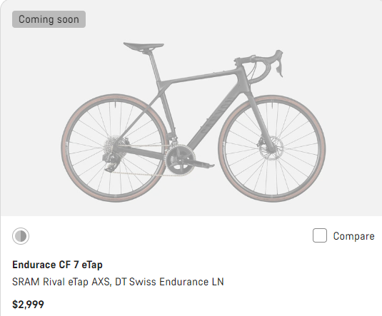
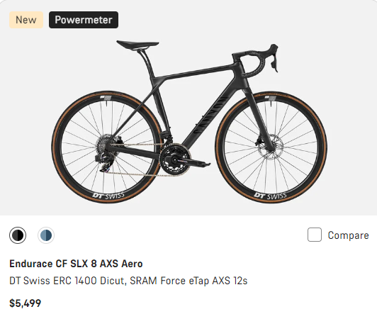
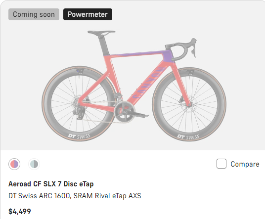

+++
title = 'Bike Upgrade'
date = 2023-10-04T12:47:50-04:00
draft = true
tags = ["Bikes"]
categories = ["Cycling"]
+++

## Update Equipment

<!--  -->



My newest bike is the 2010 Specialize Tarmac Comp. It experienced some frame damage about four or five years ago on a vacation in New England. The bike works, but the finish and coating was damaged which maybe leading to questionable integrity of the frame.  The drive components, headset and wheels were replace in 2017 with Shimano 150 7000 components. It is still riding, but the headset / front end, is lose and may not be repairable.  I've had good times with the bike, but the frame is probably ready for the landfill.

My next bike will probably not be my last, I'm guessing there will be an E-assist in my future retirement years, for now I am looking for a reasonable bike with electronic shifting and disk brakes. I am beginning to realize that Aero and racing frames look way cool, but they are not going to be worth the money at my level. So I'm looking for an endurance bike.  I've looked at a few major brands, but the best deal seems to be Canyon CF 7. The CF SLX 8 Aero is a sweet step up.

{}

- Disk Brakes
- eTap Rival AXP drivetrain
- Alloy Wheelset
- Weight 8.62 kg (19 lb)
- $2,999

{}

{}

- Disk Brakes
- eTap Force (+$580)
- DT Swiss ERC Carbon (+$1,600)
- Weight 7.86 kg (17.3 lb)
- Powermeter
- Hydrologic Brake Levers
- Carbon Cockpit
- $5,499

{}

{}

- Disk Brakes
- eTap Rival AXP
- Weight 8.22 kg (18 lb)
- DT ARC 1600 Carbon
- $4,499

{}
